# WEEK 3 | PASSWORD CRACKING PRACTICALS

## John the Ripper (JTR) & Networkwalks Password Cracking Tools

**Cybersecurity Internship Program – Networkwalks**

---

## 👤 Student Information

| Field          | Details                             |
| -------------- | ----------------------------------- |
| Student Name   | Rashmi Bishen                       |
| Batch          | B082                                |
| Week           | Week 03                             |
| Modules        | Project Module 1 & Project Module 2 |
| Practical Area | Password Cracking                   |
| Environment    | Windows PC                          |


---

# 📌 Week 3 Overview

During Week 3 of my Cybersecurity Internship Program at Networkwalks, I completed two practical modules related to password cracking and password security.

### Modules Completed

* **Project Module 1 – Password Cracking with JTR**
* **Project Module 2 – Password Cracking with Networkwalks Tools**

Both practicals were performed using the authorized lab PDF file `My Locked PDF1.pdf`.

The activities helped me understand how password-protected files can be analyzed, how password hashes are extracted, and how password-cracking tools can be used in an authorized security-testing environment.

---

# ⚠️ Ethical & Legal Disclaimer

All activities documented in this repository were performed strictly for educational and authorized cybersecurity training purposes.

The techniques demonstrated in these practicals should only be used on files, systems, or data for which appropriate authorization has been provided.

Password cracking or attempting to access protected information without authorization may violate laws and organizational policies.

The practicals in this repository were performed using the file provided as part of the Networkwalks educational lab.

---

# 🎯 Learning Objectives

The main objectives of Week 3 were:

* Understand the concept of password cracking.
* Understand the role of password hashes.
* Learn how password-protected PDF files can be analyzed.
* Extract a PDF password hash.
* Use John the Ripper to perform password cracking.
* Use Johnny GUI to interact with John the Ripper.
* Use Networkwalks Hash Calculator.
* Use Networkwalks Password Cracker.
* Understand the effect of weak and predictable passwords.
* Learn the importance of strong password protection.
* Practice documenting cybersecurity activities professionally.

---

# 🛠️ Tools & Technologies

| Tool                          | Purpose                                 |
| ----------------------------- | --------------------------------------- |
| John the Ripper (JTR)         | Password cracking                       |
| Johnny GUI                    | Graphical interface for John the Ripper |
| Networkwalks Hash Calculator  | PDF hash extraction                     |
| Networkwalks Password Cracker | Password recovery                       |
| Web Browser                   | Access online tools                     |
| Windows PC                    | Practical environment                   |
| Notepad                       | Saving the extracted hash               |
| My Locked PDF1.pdf            | Authorized lab file                     |

---

# 🔹 PROJECT MODULE 1

# PASSWORD CRACKING WITH JTR

## 1. Background

John the Ripper (JTR) is a password-cracking tool commonly used by security professionals to evaluate password strength.

It supports different types of password hashes and can be used with password-protected files such as PDFs, ZIP files, and Office documents.

Johnny is the graphical user interface for John the Ripper. It provides a point-and-click interface that makes it easier for beginners to work with JTR.

This practical demonstrates the use of both **John the Ripper and Johnny** to recover the password of an authorized protected PDF file.

---

## 2. Objective

The objective of this practical was to:

* Install John the Ripper on Windows.
* Install and configure Johnny GUI.
* Extract the password hash from the provided PDF.
* Save the hash in a text file.
* Load the hash into Johnny.
* Start a password-cracking attack.
* Recover the PDF password.
* Verify the recovered password by opening the PDF.

---

## 3. Practical Environment

**Operating System:** Windows

**Input File:** `My Locked PDF1.pdf`

**Tools:**

* John the Ripper
* Johnny GUI
* Online PDF Hash Extractor
* Notepad

---

## 4. Methodology

### Step 1 – Download John the Ripper

John the Ripper was downloaded for the Windows environment from the official Openwall source.

**Official Website:**

https://www.openwall.com/john/

### Evidence

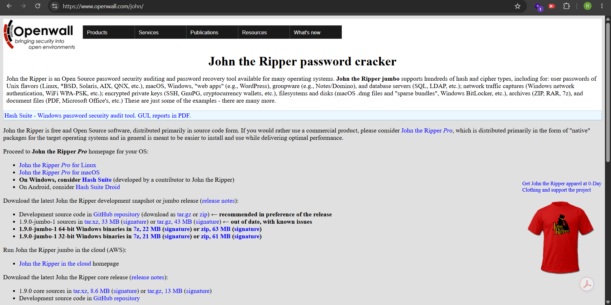

---

### Step 2 – Download and Install Johnny

Johnny GUI was downloaded and installed on the Windows system.

After installation, Johnny was opened.

The **Settings** option was used to configure the location of `john.exe`.

The `john.exe` file was selected from the JTR `run` directory.

### Evidence

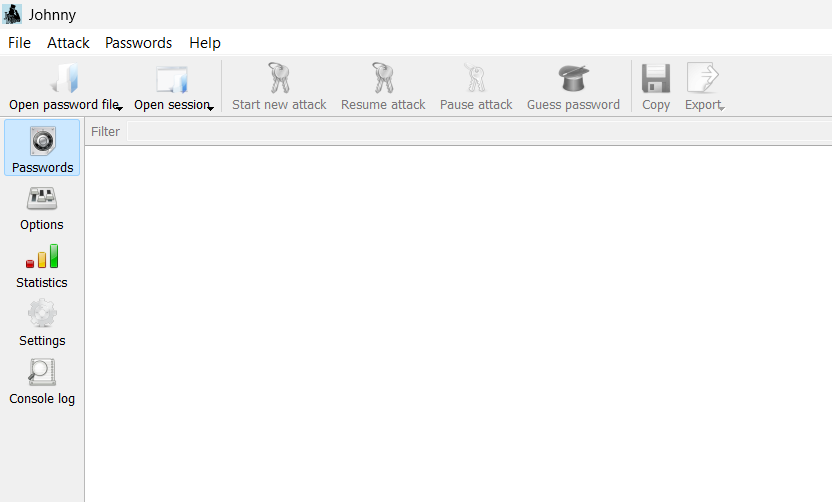

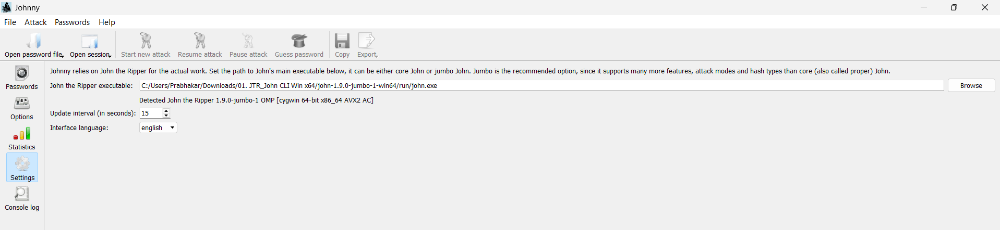


---

### Step 3 – Obtain the PDF Hash

The provided encrypted PDF file `My Locked PDF1.pdf` was processed using the PDF hash extraction website.

The PDF was uploaded to the hash extractor.

### Evidence
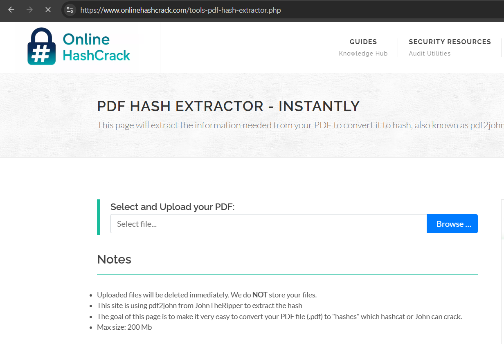

---

### Step 4 – Copy the Hash

The generated PDF hash was copied.

The hash was required to begin with:

```text
$pdf$
```

Any unnecessary characters appearing before the hash were removed before saving it.

### Evidence

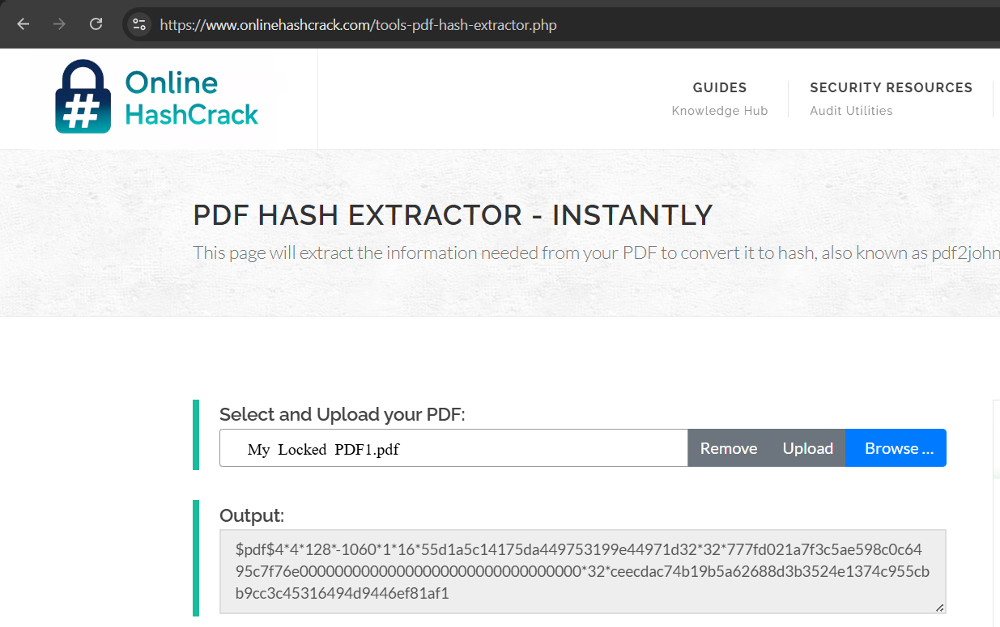

---

### Step 5 – Create Hash File

Notepad was opened and the extracted hash was pasted into a new file.

The file was saved as:

```text
hash1.txt
```

### Evidence
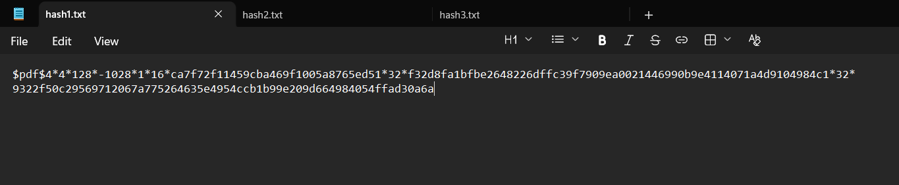


---

### Step 6 – Open Password File in Johnny

Johnny was opened.

The **Open password file** option was selected.

The previously created `hash1.txt` file was selected.

### Evidence

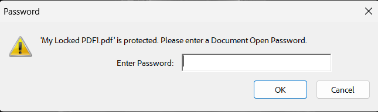

---

### Step 7 – Start New Attack

After loading the password file, the **Start new attack** option was selected.

Johnny then used John the Ripper to attempt to recover the password.

### Evidence

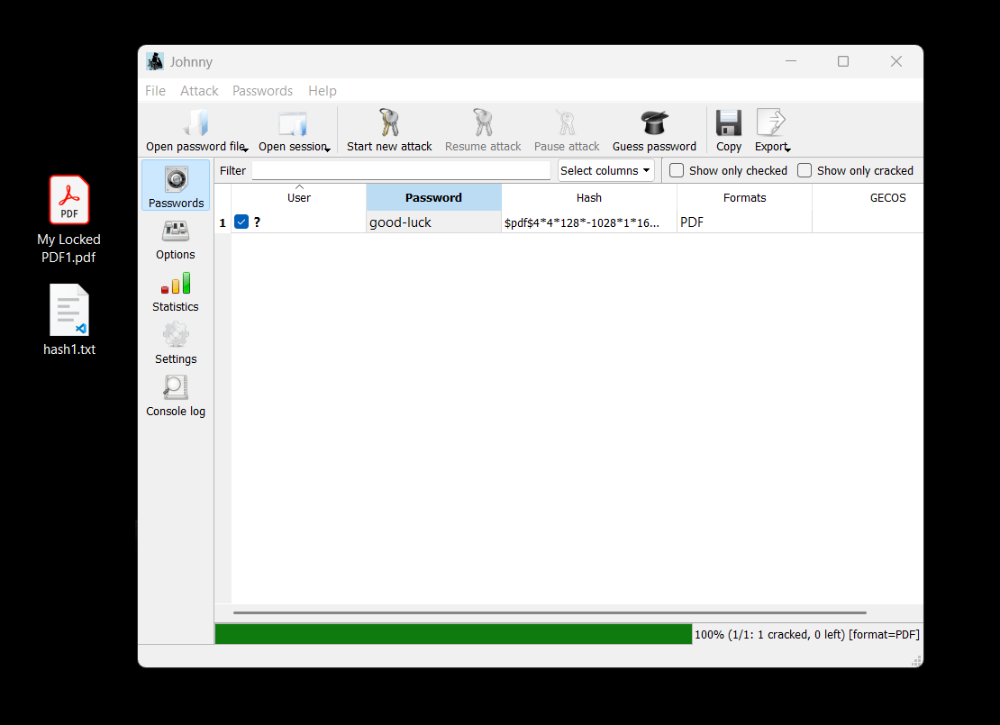

---

### Step 8 – Password Recovery

The password-cracking process successfully recovered the password.

### Recovered Password

```text
good-luck
```

### Evidence

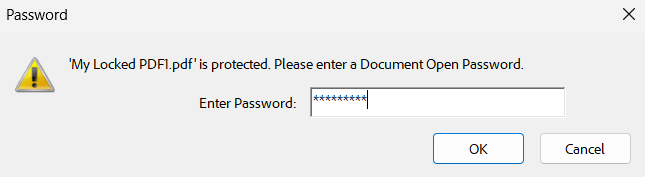


---

### Step 9 – Verify the Password

The protected PDF was opened and the recovered password was entered.

```text
good-luck
```

The PDF opened successfully.

### Evidence


---

## 5. Result

| Parameter          | Result                   |
| ------------------ | ------------------------ |
| File               | My Locked PDF1.pdf       |
| Hash File          | hash1.txt                |
| Hash Prefix        | `$pdf$`                  |
| Tool               | John the Ripper / Johnny |
| Password Recovery  | Successful               |
| Recovered Password | `good-luck`              |
| PDF Verification   | Successful               |

---

# 🔹 PROJECT MODULE 2

# PASSWORD CRACKING WITH NETWORKWALKS TOOLS

## 1. Background

Password cracking is the process of attempting to recover a password from stored or protected data.

Security professionals use password-cracking techniques in authorized environments to evaluate password strength and demonstrate the risks associated with weak passwords.

A protected file contains information that can be used for password verification. In this practical, a hash was extracted from a password-protected PDF and then supplied to a password-cracking tool.

Networkwalks provides two browser-based tools for this practical:

1. **Hash Calculator**
2. **Password Cracker**

The practical demonstrates the password-recovery process without requiring additional software installation.

---

## 2. Objective

The objective of this practical was to:

* Understand password hashing.
* Extract the PDF hash.
* Use the Networkwalks Hash Calculator.
* Use the Networkwalks Password Cracker.
* Recover the password of the provided lab PDF.
* Verify the recovered password.
* Understand the importance of strong passwords.

---

## 3. Methodology

### Step 1 – Download the Locked PDF

The file `My Locked PDF1.pdf` was downloaded from the Networkwalks practical lab page.

### Evidence
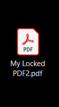


---

### Step 2 – Open Networkwalks Hash Calculator

The Networkwalks Hash Calculator was opened in a web browser.

**Tool:**

https://networkwalks.com/hash-calculator/

### Evidence

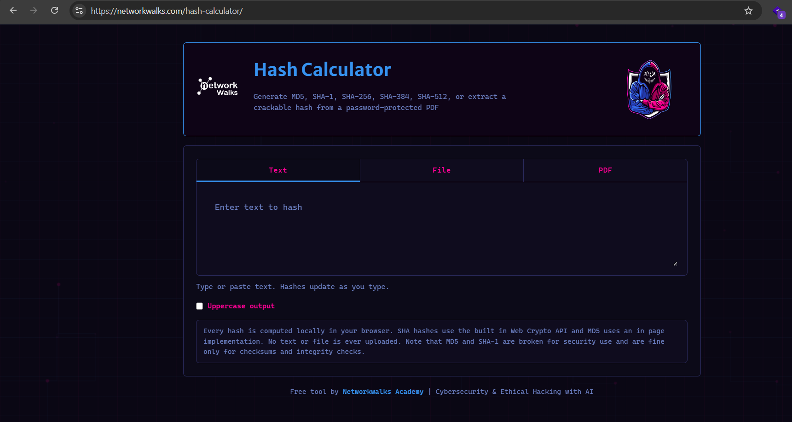

---

### Step 3 – Upload the PDF

The protected PDF was uploaded to the Hash Calculator.

The tool processed the file and generated a PDF hash.

The generated hash started with:

```text
$pdf$
```

### Evidence
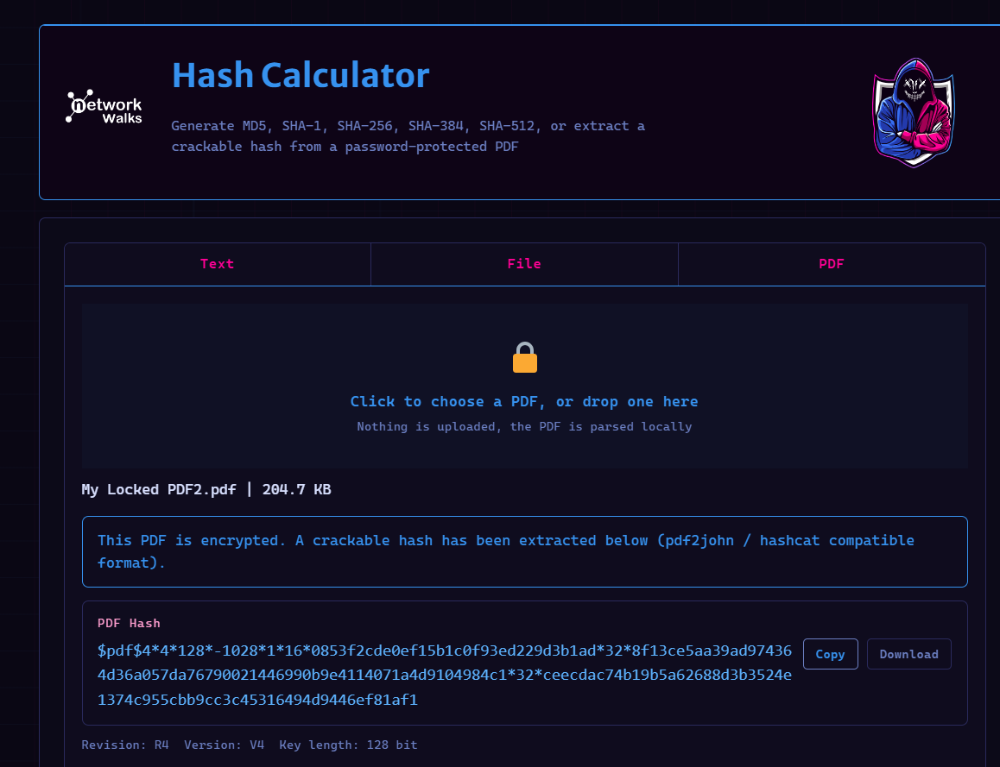


---

### Step 4 – Copy the Complete Hash

The complete hash was copied for use in the Password Cracker.

Care was taken to copy the complete hash beginning from `$pdf$`.


---

### Step 5 – Open Password Cracker

The Networkwalks Password Cracker was opened.

**Tool:**

https://networkwalks.com/password-cracker/

### Evidence
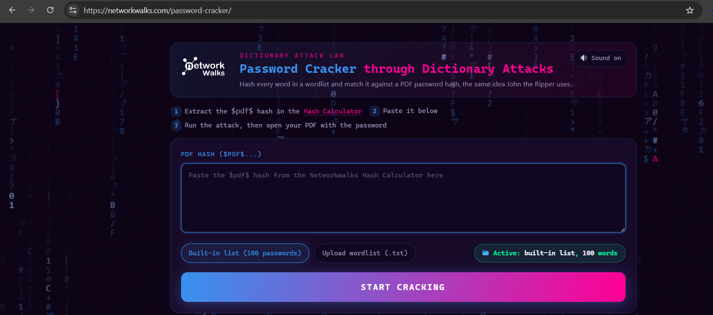

---

### Step 6 – Start Password Cracking

The extracted PDF hash was pasted into the Password Cracker.

The cracking process was started.

The tool attempted different password candidates to identify a matching password.

### Evidence

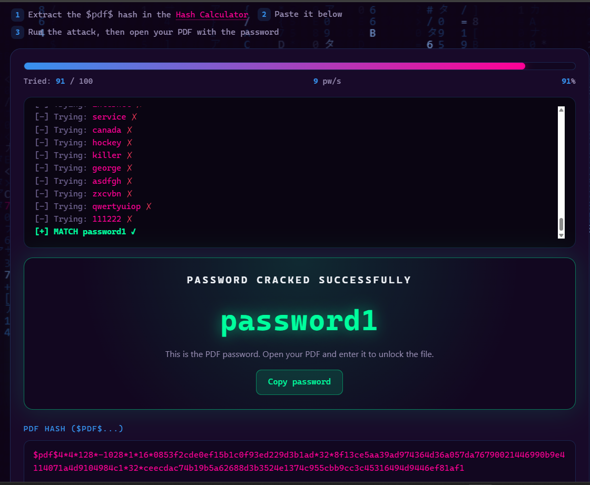

---

### Step 7 – Recover Password

The password was successfully recovered.

### Recovered Password

```text
password1
```

### Evidence
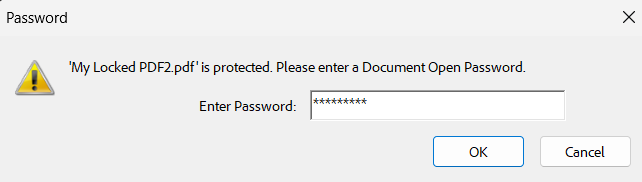


---

### Step 8 – Verify the Password

The recovered password was entered into the protected PDF.

```text
password1
```

The PDF opened successfully.

### Evidence
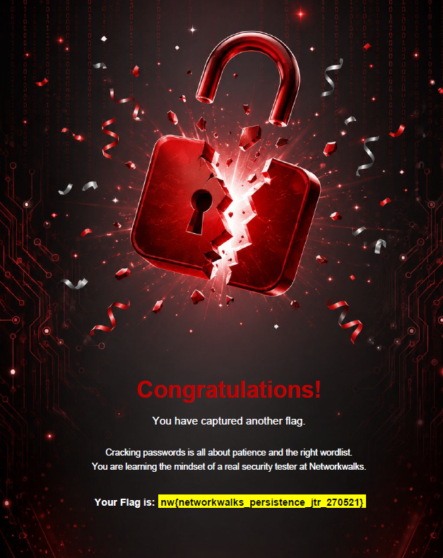


---

## 4. Result

| Parameter          | Result             |
| ------------------ | ------------------ |
| File               | My Locked PDF1.pdf |
| Hash Type          | PDF Password Hash  |
| Hash Prefix        | `$pdf$`            |
| Hash Extraction    | Successful         |
| Password Cracking  | Successful         |
| Recovered Password | `password1`        |
| PDF Unlocking      | Successful         |

---

# 📊 COMPARISON OF BOTH MODULES

| Feature           | Module 1 – JTR            | Module 2 – Networkwalks Tools |
| ----------------- | ------------------------- | ----------------------------- |
| Main Tool         | John the Ripper           | Networkwalks Password Cracker |
| Interface         | Command-line / Johnny GUI | Web Browser                   |
| Hash Extraction   | PDF Hash Extractor        | Networkwalks Hash Calculator  |
| Hash File         | `hash1.txt`               | Direct hash input             |
| Installation      | Required for Windows      | Not required                  |
| Password Recovery | Successful                | Successful                    |
| Final Password    | `good-luck`               | `password1`                   |

---

# 🔐 RISK ANALYSIS

| No. | Finding                              | Potential Impact                                                | Risk   |
| --- | ------------------------------------ | --------------------------------------------------------------- | ------ |
| 1   | Weak password                        | Easier password recovery                                        | Medium |
| 2   | Predictable password                 | Password guessing becomes easier                                | Medium |
| 3   | Protected PDF using weak credentials | Sensitive information could be exposed if password is recovered | Medium |

These findings relate only to the authorized educational lab file.

No unauthorized system, account, or personal document was targeted.

---

# 🛡️ RECOMMENDATIONS

1. Use long and unique passwords for protected files.
2. Avoid common passwords such as `password1`.
3. Avoid predictable password patterns.
4. Do not reuse passwords across different services or files.
5. Use a password manager to create strong passwords.
6. Apply suitable encryption to sensitive documents.
7. Protect password-protected files from unauthorized access.
8. Perform password-strength testing only on authorized systems and files.

---

# 📚 KEY LEARNINGS

During Week 3, I learned:

* The basic concept of password cracking.
* The role of hashes in password-protected files.
* How PDF hashes can be extracted.
* How John the Ripper can be used for password recovery.
* How Johnny provides a graphical interface for JTR.
* How browser-based password-cracking tools can be used.
* How weak passwords can be recovered more easily.
* The importance of strong and unique passwords.
* The importance of ethical and authorized security testing.

---

# 📸 EVIDENCE

## Module 1 – JTR

1. John the Ripper Download
2. Johnny Installation
3. Johnny Settings
4. `john.exe` Configuration
5. PDF Hash Extraction
6. Extracted Hash
7. `hash1.txt`
8. Open Password File
9. Start New Attack
10. Cracked Password
11. Successfully Opened PDF

## Module 2 – Networkwalks Tools

1. Downloaded PDF
2. Networkwalks Hash Calculator
3. Uploaded PDF
4. Generated PDF Hash
5. Complete Hash
6. Networkwalks Password Cracker
7. Password Cracking Process
8. Recovered Password
9. Successfully Opened PDF

---

# 📝 ETHICAL CONSIDERATION

Password-cracking tools are valuable for cybersecurity education, password-strength assessment, and authorized security testing.

However, these tools must not be used to access files, accounts, or systems without permission.

All activities documented in this project were performed using the authorized educational lab material provided by Networkwalks.

---

# ✅ CONCLUSION

During Week 3 of my Cybersecurity Internship Program, I completed two practical modules focused on password cracking and password security.

In **Project Module 1**, I used John the Ripper and Johnny to recover the password of the provided protected PDF. The PDF hash was extracted, saved in `hash1.txt`, loaded into Johnny, and processed using John the Ripper. The password `good-luck` was successfully recovered and verified.

In **Project Module 2**, I used the Networkwalks Hash Calculator to extract the PDF hash and the Networkwalks Password Cracker to recover the password. The recovered password was again verified successfully by opening the protected PDF.

Both practicals demonstrated how weak and predictable passwords can be recovered using password-cracking techniques. The exercises reinforced the importance of using strong, unique, and unpredictable passwords to protect sensitive information.

Most importantly, these practicals improved my understanding of password security and reinforced the requirement that password-cracking activities must always be performed within an authorized and ethical scope.

---

## 👤 AUTHOR

**Rashmi Bishen**

**Cybersecurity Internship Program – Networkwalks**

**Batch:** B082

**Week:** 03

**Project:** Password Cracking with JTR & Networkwalks Tools

