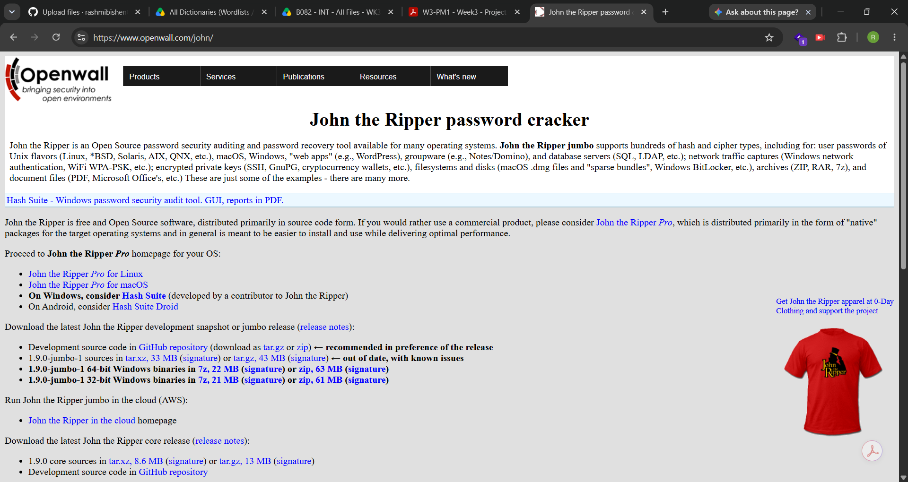

# 🔐 Week 3 – Project Module 1: Password Cracking with John the Ripper (JTR)

## 📌 Overview
This project demonstrates the use of John the Ripper (JTR) and Johnny GUI to recover the password of an authorized password-protected PDF file.

The objective of this practical exercise is to understand how password-protected files can be tested for password strength using password-cracking techniques in a controlled cybersecurity lab environment.

Ethical Use: This practical was performed only on an authorized/training PDF file for educational and cybersecurity research purposes. Password-cracking techniques should never be used against files, accounts, or systems without permission.

## 🎯 Objectives
- Understand the fundamentals of password cracking.
- Learn the basic working of John the Ripper.
- Use Johnny, the graphical interface for JTR.
- Extract the password hash from a protected PDF.
- Prepare the extracted hash for JTR.
- Perform a password-cracking attack using JTR/Johnny.
- Verify the recovered password by opening the authorized PDF.
- Understand the importance of strong passwords.

## 🛠️ Tools & Technologies
## Tool	                               Purpose
- John the Ripper (JTR)              	Password-cracking and password-security testing
- Johnny GUI	                          Graphical interface for John the Ripper
- PDF Hash Extractor	                  Extracting the password hash from the authorized PDF
- Notepad	                              Saving and preparing the extracted hash
- Windows PC                           	Lab environment
  
## 🔐 Key Concepts
Hashing vs Encryption

- Encryption is generally a reversible process when the correct key is available. It is designed to protect information so that authorized users can recover the original data.

- Hashing is designed as a one-way transformation that converts input data into a fixed-format digest. Password-cracking tools work by testing possible passwords and comparing their resulting values with the target hash.

- In this practical, the password-protected PDF was processed to obtain a hash representation that could be supplied to John the Ripper for password testing.

## 🧪 Practical Procedure
### Step 1 – Install John the Ripper

John the Ripper was downloaded from the official Openwall project website and extracted/installed on the Windows system.

The JTR executable required for the practical is located inside the run directory.

- Official Source:
https://www.openwall.com/john/

## Evidence

- Step 2 – Install and Configure Johnny

Johnny is a graphical user interface for John the Ripper.

- After installing Johnny:

- Open Johnny.
- Open Settings.
- Browse to the JTR installation directory.
- Select john.exe from the run folder.
- Save/apply the configuration.
## Evidence

- Step 3 – Prepare the Authorized PDF

The provided password-protected PDF file was downloaded to the local Windows system.

## Input File:

My Locked PDF1.pdf

- The file was used only as the authorized training target for this practical.

## Evidence

- Step 4 – Extract the PDF Hash

- The PDF hash was extracted using a PDF hash extraction utility.

- The authorized PDF was uploaded to the tool and the generated hash was copied.

- The extracted value was checked to ensure that it was in the expected PDF hash format.

- If the extracted output contains additional characters such as b' at the beginning, they should not be included in the hash file.

## Evidence

- Step 5 – Create the Hash File

- A text file was created using Notepad.

- The extracted PDF hash was pasted into the file and saved as:

- hash1.txt

- The hash was stored as plain text so that it could be supplied to John the Ripper.

## Evidence

- Step 6 – Open the Hash in Johnny

- Johnny was opened again and the Open Password File option was selected.

- The previously created hash1.txt file was then selected.

  ## Evidence

- Step 7 – Start the Password Attack

After loading the hash file:

- Click Start New Attack.
- Allow Johnny/JTR to test candidate passwords.
- Monitor the attack progress.
- Wait until the password is recovered.

The time required can vary depending on the password complexity and system performance.

## Evidence

-  Step 8 – Verify the Recovered Password

- After the password was recovered, the password was used to open the authorized password-protected PDF.

Successful opening of the PDF confirmed that the recovered password was correct.

## Evidence

## 📊 Result

The password of the authorized training PDF was successfully recovered using John the Ripper through the Johnny GUI.

The recovered password was then verified by opening the protected PDF.

### Result: ✅ Password successfully recovered

## 🧠 Learning Outcomes

Through this practical, I learned:

- How password-protected PDF files can be represented as hashes for security testing.
- The basic workflow of John the Ripper.
- How Johnny provides a graphical interface for JTR.
- How password hashes are supplied to password-cracking tools.
- Why password complexity affects password-cracking difficulty.
- The importance of using strong and unique passwords.
- The difference between encryption and hashing.
- The importance of performing security testing only with proper authorization.

## 🔒 Security Recommendations

To make passwords more resistant to password-cracking attempts:

- Use long and complex passwords.
- Avoid dictionary words and predictable patterns.
- Do not reuse passwords across different services.
- Use unique passwords for sensitive files and accounts.
- Prefer passphrases that are difficult to guess.
- Enable multi-factor authentication where available.
- Use a reputable password manager to generate and store unique passwords.
## 📚 References
### John the Ripper – Openwall
https://www.openwall.com/john/
### John the Ripper Documentation
https://www.openwall.com/john/
### Johnny GUI
https://openwall.info/wiki/john/johnny
## ⚠️ Disclaimer

This project is intended strictly for educational, cybersecurity training, and authorized security testing. The techniques demonstrated here must only be used on files, systems, or environments for which explicit permission has been obtained.
